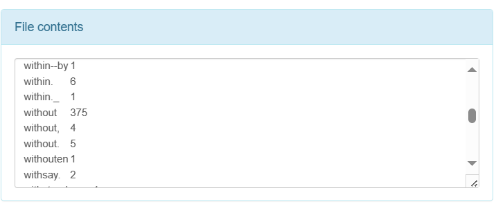
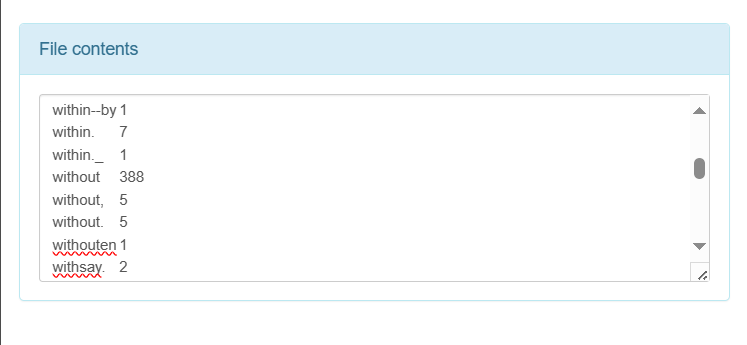

# Exercise 01 - MapReduce
Giảng viên hướng dẫn: Lê Ngọc Thành

Sinh viên thực hiện: 
MSSV | Họ tên | Email
-|-|-
21127329 | Châu Tấn Kiệt | ctkiet212@clc.fitus.edu.vn

## Bài 1: Thống kê số lượng người bình chọn ở mỗi mức
#### Ý tưởng cài đặt:
- Đếm số lượng rating của từng dòng và map với 1 và cộng lại

```python
from mrjob.job import MRJob
from mrjob.step import MRStep

class RatingsBreakdown(MRJob):
    def steps(self):
        return [
            MRStep(mapper=self.mapper_get_ratings,
                reducer=self.reducer_count_ratings)
            ]
    def mapper_get_ratings(self, _, line):
        (userID, movieID, rating, timestamp)= line.split('\t') 
        yield rating, 1
    
    def reducer_count_ratings(self, key, values):
        yield key, sum(values)

if __name__ == '__main__':
    RatingsBreakdown.run()
```
- Cú pháp chạy chương trình
```python
python BT1.py input.txt
```
- Kết quả chạy chương trình
```
Creating temp directory C:\Users\ACER\AppData\Local\Temp\BT1.ACER.20240427.064827.731999
Running step 1 of 1...
job output is in C:\Users\ACER\AppData\Local\Temp\BT1.ACER.20240427.064827.731999\output
Streaming final output from C:\Users\ACER\AppData\Local\Temp\BT1.ACER.20240427.064827.731999\output...
"1"     2
"2"     2
"3"     2
"4"     1
Removing temp directory C:\Users\ACER\AppData\Local\Temp\BT1.ACER.20240427.064827.731999...
```
## Bài 2: Sắp xếp các phim theo số lượt bình chọn 
#### Ý tưởng cài đặt:
- Bước map sẽ đọc từng dòng và mỗi bộ phim được bình chọn sẽ được đếm là 1. 
- Bước shuffle và sort sẽ gom tác bộ phim có cùng mã để đưa cho reducer  
- Bước reduce sẽ tính tổng các bình chọn. Để có thể sort theo số lượt bình chọn, ta lấy tổng 
số bình chọn làm khóa cho bước shuffle và sort tiếp theo. 
- Bước reduce thứ 2 chỉ cần đảo ngược thông tin phim và số lượt bình chọn để có được danh sách sắp xếp. 

```python
from mrjob.job import MRJob
from mrjob.step import MRStep

class RatingsBreakdown(MRJob):
    def steps(self):
        return [
            MRStep(mapper=self.mapper_get_ratings,
                reducer=self.reducer_count_ratings),
            MRStep(reducer=self.reducer_sorted_output)
            ]
    def mapper_get_ratings(self, _, line):
        (userlD, movieID, rating, timestamp)= line.split('\t') 
        yield movieID, 1
    
    def reducer_count_ratings(self, key, values):
        yield str(sum(values)).zfill(5), key

    def reducer_sorted_output(self,count, movies):
        for movie in movies:
            yield movie, count

if __name__ == '__main__':
    RatingsBreakdown.run()
```

- Cú pháp chạy chương trình
```python
python BT2.py input.txt
```
- Kết quả chạy chương trình
```
Creating temp directory C:\Users\ACER\AppData\Local\Temp\BT2.ACER.20240427.065050.308523
Running step 1 of 2...
Running step 2 of 2...
job output is in C:\Users\ACER\AppData\Local\Temp\BT2.ACER.20240427.065050.308523\output
Streaming final output from C:\Users\ACER\AppData\Local\Temp\BT2.ACER.20240427.065050.308523\output...
"242"   "00001"
"265"   "00001"
"302"   "00001"
"346"   "00001"
"377"   "00001"
"474"   "00001"
"51"    "00001"
Removing temp directory C:\Users\ACER\AppData\Local\Temp\BT2.ACER.20240427.065050.308523...
```

## Bài 3: Thống kê mỗi từ xuất hiện trong tài liệu cho trước
Dữ liệu gồm 3 cuốn sách: 
- http://www.gutenberg.org/ebooks/20417 
- http://www.gutenberg.org/ebooks/5000 
- http://www.gutenberg.org/ebooks/4300 
### 3a: Trường hợp phân biệt hoa thường 
- Bài toán này là bài toán Word Count điển hình của MapReduce
```java
public void map(Object key, Text value, Context context
                ) throws IOException, InterruptedException {
    
    StringTokenizer itr = new StringTokenizer(value.toString());
    while (itr.hasMoreTokens()) {
        word.set(itr.nextToken()); 
        context.write(word, one);
    }
}
```
#### Chạy trên HDFS
- Compile thành file jar:
```
javac -classpath $(hadoop classpath) -d class WordCount.java
jar -cvf WordCount.jar -C class/ .
```
- Chạy chương trình: 
```
hadoop jar WordCount.jar WordCount /Ex01/input /Ex01/output
```
- Kết quả chương trình:

### 3b: Trường hợp phân biệt không phân biệt hoa thường 
- Cách tiếp cận bài toán này cũng tương đồng với yêu cầu 3a, nhưng khác ở việc chúng ta cần phải chuyển tất cả các từ khóa về dạng in hoa hoặc in thường. 
```java
public void map(Object key, Text value, Context context
                ) throws IOException, InterruptedException {
     
    StringTokenizer itr = new StringTokenizer(value.toString());
        while (itr.hasMoreTokens()) {
        word.set(itr.nextToken().toLowerCase()); 
    context.write(word, one);
    }
}
```
#### Chạy trên HDFS
- Compile thành file jar:
```
javac -classpath $(hadoop classpath) -d class WordCountNoCap.java
jar -cvf WordCountNoCap.jar -C class/ .
```
- Chạy chương trình: 
```
hadoop jar WordCountNoCap.jar WordCountNoCap /Ex01/input /Ex01/output
```
- Kết quả chương trình:



## Bài 4: Tìm từ xuất hiện nhiều nhất trong tài liệu (không phân biệt hoa thường).

#### Ý tưởng cài đặt: Sử dụng 2 Reducer
- Reducer 1 dùng để tìm số lượng từ như bài Word Count
- Reducer 2 dùng để lấy phần tử có tần suất cao nhất

```python
from mrjob.job import MRJob
from mrjob.step import MRStep

class MaxWord(MRJob):
    def steps(self):
        return [
            MRStep(mapper=self.mapper_get_word,
                   combiner=self.combiner_count_word,
                   reducer=self.reducer_count_word),
            MRStep(reducer=self.reducer_find_max_word)
        ]
    
    def mapper_get_word(self, _, line):
        for word in line.split(" "):
            word = word.lower()
            yield word, 1

    def combiner_count_word(self, word, counts):
        yield (word, sum(counts))

    def reducer_count_word(self, word, counts):
        yield None, (sum(counts), word)

    def reducer_find_max_word(self, _, word_count_pairs):
        try:
            yield max(word_count_pairs)
        except ValueError:
            pass

if __name__ == '__main__':
    MaxWord().run()
```

- Kết quả chạy chương trình: 
```python
Creating temp directory C:\Users\ACER\AppData\Local\Temp\BT4.ACER.20240427.075651.238306
Running step 1 of 2...
Running step 2 of 2...
job output is in C:\Users\ACER\AppData\Local\Temp\BT4.ACER.20240427.075651.238306\output
Streaming final output from C:\Users\ACER\AppData\Local\Temp\BT4.ACER.20240427.075651.238306\output...
53      "i"
Removing temp directory C:\Users\ACER\AppData\Local\Temp\BT4.ACER.20240427.075651.238306...
```