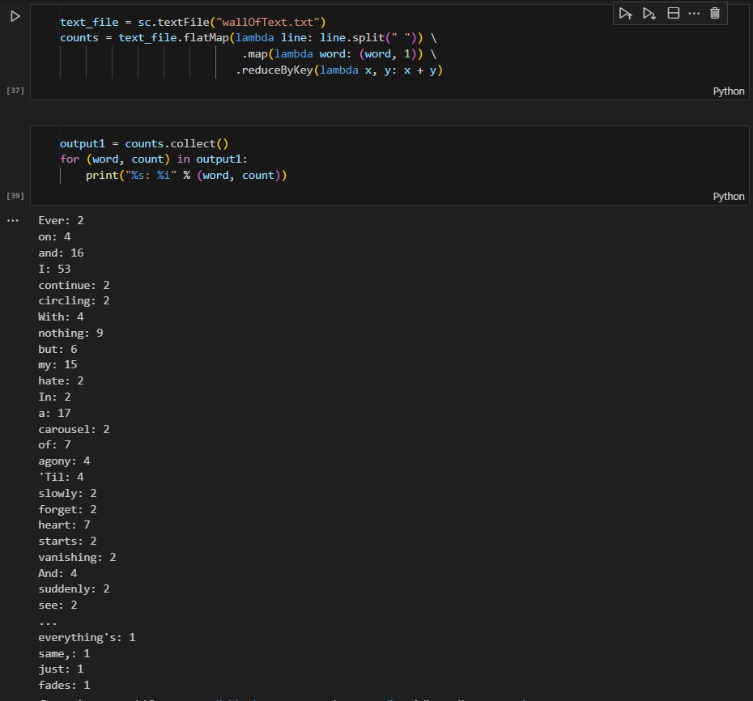
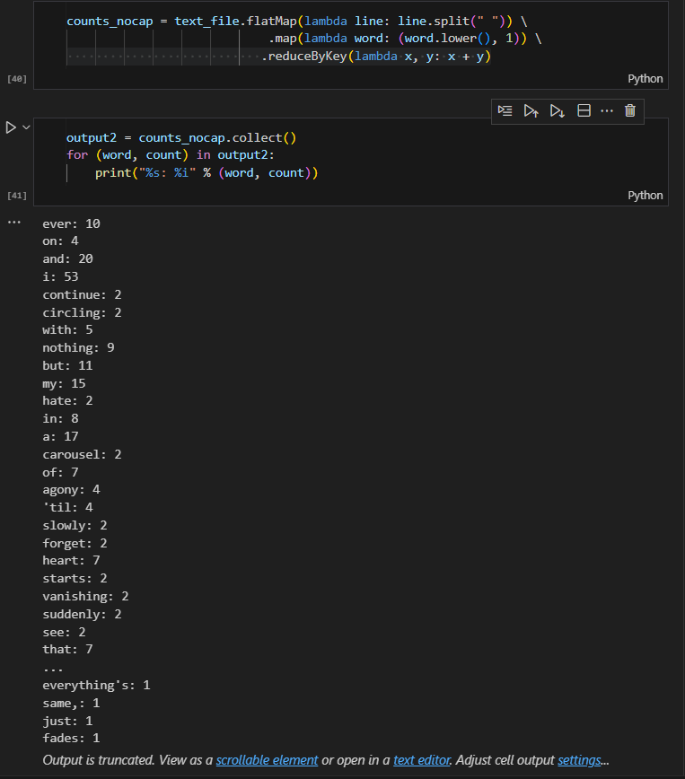
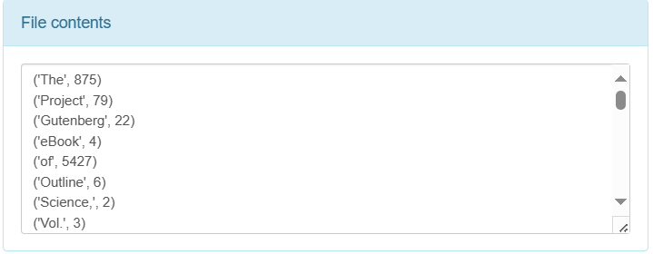
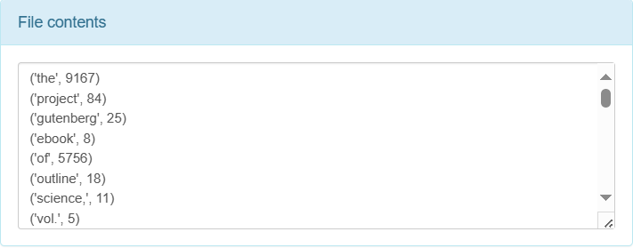
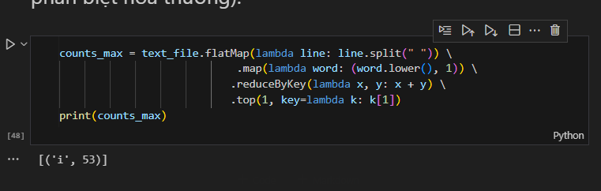

# Exercise 01 - MapReduce
Giảng viên hướng dẫn: Lê Ngọc Thành

Sinh viên thực hiện: 
MSSV | Họ tên | Email
-|-|-
21127329 | Châu Tấn Kiệt | ctkiet212@clc.fitus.edu.vn


## Đọc file input
```scala
scala> val df = spark.read.option("delimiter", ",").option("header", true).csv("input.csv")
val df: org.apache.spark.sql.DataFrame = [USERID: string, MOVIEID: string ... 2 more fields]

scala> df.show()
+------+-------+------+---------+
|USERID|MOVIEID|RATING|TIMESTAMP|
+------+-------+------+---------+
|   196|    242|     3|881250949|
|   186|    302|     3|891717742|
|   196|    377|     1|878887116|
|   244|     51|     2|880606923|
|   166|    346|     1|886397596|
|   186|    474|     4|884182806|
|   186|    265|     2|881171488|
+------+-------+------+---------+
```


## Bài 1: Thống kê số lượng người bình chọn ở mỗi mức
#### Ý tưởng cài đặt:
- Sử dụng hàm count và sort theo rating để thống kê số lượng bình chọn
```scala
scala> val rating_count = df.groupBy("RATING").count().sort(("RATING"))
val rating_count: org.apache.spark.sql.Dataset[org.apache.spark.sql.Row] = [RATING: string, count: bigint]

scala> rating_count.show()
+------+-----+
|RATING|count|
+------+-----+
|     1|    2|
|     2|    2|
|     3|    2|
|     4|    1|
+------+-----+
```

## Bài 2: Sắp xếp các phim theo số lượt bình chọn
#### Ý tưởng cài đặt:
- Sử dụng hàm count và sort theo MOVIEID để cài đặt bài toán
```scala
scala> val movies_count = df.groupBy("MOVIEID").count().sort(("MOVIEID"))
val movies_count: org.apache.spark.sql.Dataset[org.apache.spark.sql.Row] = [MOVIEID: string, count: bigint]

scala> movies_count.show()
+-------+-----+
|MOVIEID|count|
+-------+-----+
|    242|    1|
|    265|    1|
|    302|    1|
|    346|    1|
|    377|    1|
|    474|    1|
|     51|    1|
+-------+-----+
```
## Bài 3: Thống kê mỗi từ xuất hiện trong tài liệu cho trước
Dữ liệu gồm 3 cuốn sách: 
http://www.gutenberg.org/ebooks/20417 
http://www.gutenberg.org/ebooks/5000 
http://www.gutenberg.org/ebooks/4300 
(Tải Plain Text) 

Tương tự bài toán Word Count của MapReduce, vì vấn đề compile file jar trong quá trình thực thi trên hệ điều hành Windows, ở đây em cài đặt bài tập 3 và 4 bằng PySpark.
### 3a: Trường hợp phân biệt hoa thường 

### 3b: Trường hợp phân biệt không phân biệt hoa thường 
- Cách tiếp cận bài toán này cũng tương đồng với yêu cầu 3a, nhưng khác ở việc chúng ta cần phải chuyển tất cả các từ khóa về dạng in hoa và in thường. 

#### Chạy trên HDFS
- Trường hợp phân biệt hoa thường

- Trường hợp không phân biệt hoa thường

Có thể thấy, ở từ "the" trong trường hợp phân biệt hoa thường chỉ có 875 từ. Tuy nhiên, từ "the" ở trường hợp không phân biệt hoa thường có đến 9167 từ.
## Bài 4: Tìm từ xuất hiện nhiều nhất trong tài liệu (không phân biệt hoa thường).


