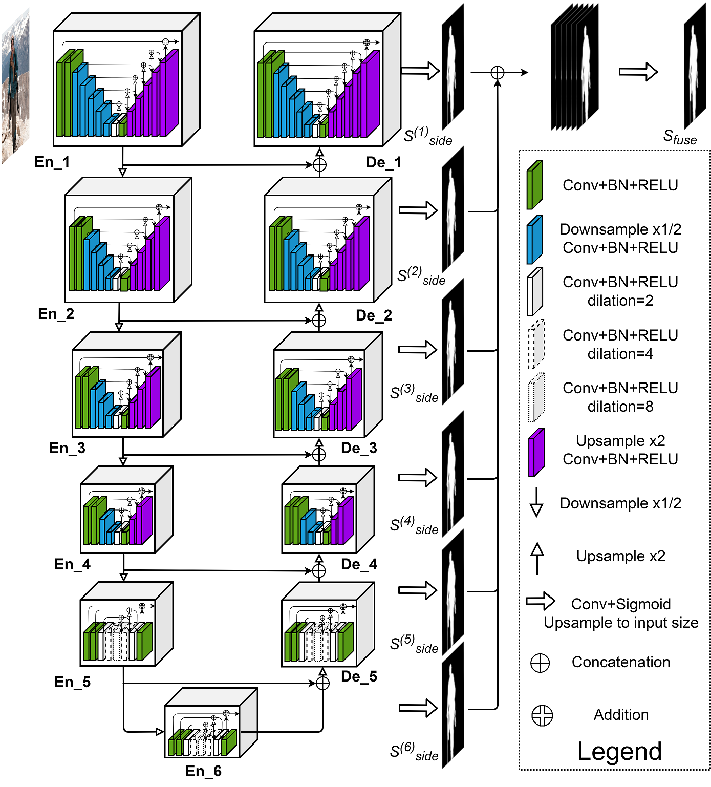
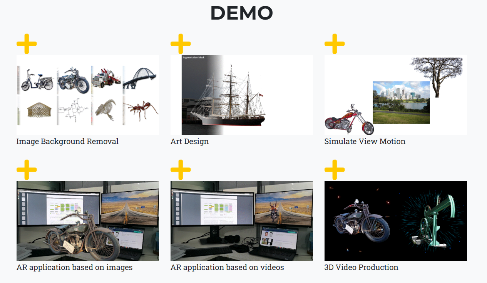

## I. Overview description of U2-Net
1. **Introduction to U2-Net**:\
   - Problem address:\
   U2-Net is an architecture that aims to identify salient objects within an image.
   The primary goal of U2-Net is to achieve accurate saliency detection while maintaining efficiency in terms ofmemory usage and computation cost.\
   - Solution developers and users\
   The solution, U2-Net (U square net), is developed by a team of researchers: Xuebin Qin, Zichen Zhang, Chenyang Huang, Masood Dehghan, Osmar R. Zaiane, and Martin Jagersand. Potential users of this solution include developers and creators in various fields such as mobile app development, art design, image editing, and academic research, as evidenced by the diverse applications and integrations listed on the page. These users leverage U2-Net for tasks like portrait drawing, background removal, and other image segmentation projects.\
   - Background of the research:\
      The paper begins by explaining the concept of Salient Object Detection (SOD) , which is the process of identifying the most visually striking objects in an image. It is a crucial task used in various applications like visual tracking and image segmentation.

      The authors highlight the challenges in SOD, particularly the reliance on deep features extracted by backbones designed for image classification, which may not be optimal for local details and global contrast essential for saliency detection.

      Also, the paper poses the question of whether a new network can be designed for SOD that allows training from scratch and achieves comparable or better performance than existing models based on pre-trained backbones.

      The paper also addresses the challenge of maintaining high-resolution feature maps while going deeper into the network architecture without significantly increasing memory and computation costs. Thus, the authors propose U2Net to tackle these issues.
   
   - Some references for this solution can be found here:\
      Paper: https://arxiv.org/abs/2005.09007v3\
      GitHub: https://github.com/xuebinqin/U-2-Net\
      Demo: https://playtorch.dev/snack/@playtorch/u2net\
      There are some products that use U2Net, such as:\
      - [Hotpot.ai](https://hotpot.ai/) integrated U2Net for art design:
      
      - [Lensto](https://apps.apple.com/in/app/lensto-autobackground-changer/id1574844033), a photoshopping mobile application, was also based on U2Net
      

## II. List key features of the solution while emphasizing the functions that demonstrate pattern recognition. If you know the corresponding algorithms, state them. 

### 1. **Key Features**:
   - **Efficiency**: U2-Net achieves high-resolution saliency detection without excessive computational overhead.
   - **Multi-Scale Features**: The RSU module captures multi-scale features within each stage.
   - **Saliency Accuracy**: U2-Net performs well in identifying salient regions in images.

### 2. **Nested U-Structure**:\
U2-Net is a two-level nested U-structure that is designed for SOD without using any pre-trained backbones
from image classification. It can be trained from scratchto achieve competitive performance   
   - **Bottom Level**:
     - At the bottom level, U2-Net features a novel component called the **ReSidual U-block (RSU)** module.
     - The RSU module extracts intra-stage multi-scale features without degrading the feature map resolution.
   - **Top Level**:
     - The top level resembles a **U-Net** structure, where each stage is filled with an RSU block.
     - This design allows U2-Net to go deeper into the network while maintaining high resolution.
     - Importantly, this depth increase does not significantly impact memory or computation requirements.\

### 3. **Residual U-block (RSU)**
The Residual U-block (RSU) is a novel structure designed for capturing multi-scale contextual information within a deep learning architecture. Here are the key points about RSU:
   - Multi-Scale Feature Extraction: RSU is capable of extracting features at multiple scales without degrading the feature map resolution, which is crucial for tasks like salient object detection.
   - Nested U-Structure: It employs a U-Net-like encoder-decoder structure within each block to learn and encode multi-scale contextual information1.
   - Efficient Design: Despite increasing the depth of the network, RSU maintains high-resolution feature maps at a low memory and computation cost due to its efficient design that includes pooling operations.
   - Residual Connection: The block uses a residual connection to fuse local features with multi-scale features, enhancing the flow of information and gradients through the network, which helps in training deeper models.
   Overall, the RSU block is a key component of the U2-Net architecture, contributing to its ability to perform well in salient object detection tasks.

### 4. **U2-Net Architecture**\
Using the Nested U-Structure and RSU, the model can capture more contextual information at different scales without sacrificing image quality

## III. Evaluate the pros and cons of the solution and its potential in the future

### Pros of U2-Net:

1. **High Saliency Accuracy**:
   - U2-Net excels in identifying salient objects within images.
   - Its nested U-structure allows it to capture multi-scale features, leading to accurate saliency maps.

2. **Efficiency**:
   - Despite its depth, U2-Net remains efficient in terms of memory usage and computation cost.
   - This efficiency is crucial for real-time applications and large-scale image processing.

3. **Multi-Scale Features**:
   - The RSU module within U2-Net extracts multi-scale features at each stage.
   - This enables robust saliency detection across different object sizes and complexities.

4. **Versatility**:
   - U2-Net finds applications beyond saliency detection:
     - **Image Segmentation**: Dividing images into meaningful regions.
     - **Object Cropping**: Efficiently isolating specific objects.

### Cons of U2-Net:

1. **Complex Architecture**:
   - The nested U-structure may be challenging to understand and implement.
   - Training and fine-tuning require expertise in deep learning.

2. **Limited Contextual Information**:
   - U2-Net focuses on local features within an image.
   - It may struggle with global context understanding, especially in complex scenes.

3. **Data Dependency**:
   - Like most deep learning models, U2-Net relies heavily on high-quality labeled data.
   - Insufficient or biased training data can impact its performance.

### Future Potential:

1. **Refinement and Optimization**:
   - Researchers can continue refining U2-Net's architecture and training strategies.
   - Optimizing memory usage and computational efficiency will enhance its practicality.

2. **Integration with Other Models**:
   - Combining U2-Net with complementary architectures could yield even better results.
   - Hybrid models that leverage both local and global context may emerge.

3. **Domain-Specific Adaptations**:
   - U2-Net can be fine-tuned for specific domains (e.g., medical imaging, satellite imagery).
   - Customizing it for specialized tasks will unlock new applications.

4. **Interdisciplinary Applications**:
   - As AI intersects with fields like robotics, autonomous vehicles, and augmented reality, U2-Net's saliency detection could play a crucial role.

In summary, U2-Net's balance between accuracy and efficiency positions it well for future advancements. Its impact will likely extend beyond traditional computer vision tasks, shaping how we interact with visual data.

## IV.  Identify at least two solutions with similar functionalities, and briefly describe them (2- 3 sentences per each)

### 1. Highly Accurate Dichotomous Image Segmentation
Project Page: https://xuebinqin.github.io/dis/index.html\
This is a category-agnostic DIS task for accurately segmenting objects with different structure complexites, regardless of their characteristics. Some applications include Image Background Removal, Art Design, Simulate View Motion, AR applications and 3D applications

### 2. Res2Net: A new Multi-scale Backbone Architecture
Link: https://paperswithcode.com/paper/res2net-a-new-multi-scale-backbone\
This is a novel building block for CNN that enhances multi-scale feature representation. This block introduces hierarical residual-like granular multi-scale features and expanding the range of receptive fields for each layer. This solution can be integrated into CNN models like ResNet or DLA.

